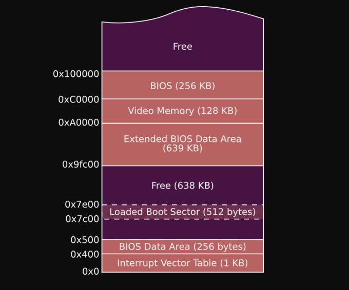

We want to know more about where the boot sector is loaded by BIOS. This code example looks at different ways to check where exactly we are located. Keep in mind the location is `0x7c00` but the code makes that clearer. 

```
b4  0e  b0  1e  cd  10  a0  1e  00  cd  10  8b  1e  1e  00  81
c3  00  7c  8a  07  cd  10  a0  2d  7c  cd  10  eb  fe  58  00
00  00  00  00  00  00  00  00  00  00  00  00  00  00  00  00
*
00  00  00  00  00  00  00  00  00  00  00  00  00  00  55  aa
```

### Hex Dump 
`xxd main.bin`

```
00000000: b40e b031 cd10 b02d cd10 b032 cd10 a02d  ...1...-...2...-
00000010: 00cd 10b0 33cd 10bb 2d00 81c3 007c 8a07  ....3...-....|..
00000020: cd10 b034 cd10 a02d 7ccd 10eb fe58 0000  ...4...-|....X..
00000030: 0000 0000 0000 0000 0000 0000 0000 0000  ................
00000040: 0000 0000 0000 0000 0000 0000 0000 0000  ................
00000050: 0000 0000 0000 0000 0000 0000 0000 0000  ................
00000060: 0000 0000 0000 0000 0000 0000 0000 0000  ................
00000070: 0000 0000 0000 0000 0000 0000 0000 0000  ................
00000080: 0000 0000 0000 0000 0000 0000 0000 0000  ................
00000090: 0000 0000 0000 0000 0000 0000 0000 0000  ................
000000a0: 0000 0000 0000 0000 0000 0000 0000 0000  ................
000000b0: 0000 0000 0000 0000 0000 0000 0000 0000  ................
000000c0: 0000 0000 0000 0000 0000 0000 0000 0000  ................
000000d0: 0000 0000 0000 0000 0000 0000 0000 0000  ................
000000e0: 0000 0000 0000 0000 0000 0000 0000 0000  ................
000000f0: 0000 0000 0000 0000 0000 0000 0000 0000  ................
00000100: 0000 0000 0000 0000 0000 0000 0000 0000  ................
00000110: 0000 0000 0000 0000 0000 0000 0000 0000  ................
00000120: 0000 0000 0000 0000 0000 0000 0000 0000  ................
00000130: 0000 0000 0000 0000 0000 0000 0000 0000  ................
00000140: 0000 0000 0000 0000 0000 0000 0000 0000  ................
00000150: 0000 0000 0000 0000 0000 0000 0000 0000  ................
00000160: 0000 0000 0000 0000 0000 0000 0000 0000  ................
00000170: 0000 0000 0000 0000 0000 0000 0000 0000  ................
00000180: 0000 0000 0000 0000 0000 0000 0000 0000  ................
00000190: 0000 0000 0000 0000 0000 0000 0000 0000  ................
000001a0: 0000 0000 0000 0000 0000 0000 0000 0000  ................
000001b0: 0000 0000 0000 0000 0000 0000 0000 0000  ................
000001c0: 0000 0000 0000 0000 0000 0000 0000 0000  ................
000001d0: 0000 0000 0000 0000 0000 0000 0000 0000  ................
000001e0: 0000 0000 0000 0000 0000 0000 0000 0000  ................
000001f0: 0000 0000 0000 0000 0000 0000 0000 55aa  ..............U.
```

### Memory Diagram 




### How did we get the offset 0x2d?

(*This is what GPT4 had to say when I had this doubt. A very good explanation!*)

Absolutely, let's break it down in simpler terms.

When you look at a hex dump, like the one you've provided, it shows the data of your file in hexadecimal (hex) format. Here's how to read and understand it:

1. **Address**: Each line in a hex dump starts with an address. This address is like a marker showing where in the file you are. For instance, `00000000` is the start of the file, `00000010` is 16 bytes into the file, and so on. Addresses are shown in hexadecimal.

2. **Hexadecimal Data**: After the address, you see a series of hexadecimal numbers. Each pair of hexadecimal digits represents one byte. For example, `b4` is one byte, `0e` is another byte, and so on.

3. **ASCII Representation (Optional)**: On the right side, you might see a representation of this data in ASCII characters, but it's not always present or useful, especially for non-text data.

Now, let's find the offset `0x2d` for the 'X' character ('58' in hex) in your hex dump:

- We start at the beginning of the file, which is address `00000000`.
- Each line shows 16 bytes of data. So, by the time we get to the second line (address `00000010`), we've already passed 16 bytes.
- We continue counting the bytes in each line until we find `58`, which is the hex representation of 'X'.

Looking at your hex dump:

```
00000000: b40e b031 cd10 b02d cd10 b032 cd10 a02d  ...1...-...2...-
00000010: 00cd 10b0 33cd 10bb 2d00 81c3 007c 8a07  ....3...-....|..
00000020: cd10 b034 cd10 a02d 7ccd 10eb fe58 0000  ...4...-|....X..
```

- `58` appears in the third line (`00000020`). 
- Since each line is 16 bytes, and `58` is near the end of this line, we add up:
  - 16 bytes from the first line (`00000000` to `0000000F`)
  - 16 bytes from the second line (`00000010` to `0000001F`)
  - 13 bytes from the third line (up to `58`, counting from the start of this line)

So, the total count is \( 16 + 16 + 13 = 45 \) bytes from the start of the file. In hexadecimal, 45 is `0x2d`.

Therefore, `0x2d` is the offset where the 'X' character appears in your file. This means that 'X' is located 45 bytes from the beginning of the file.