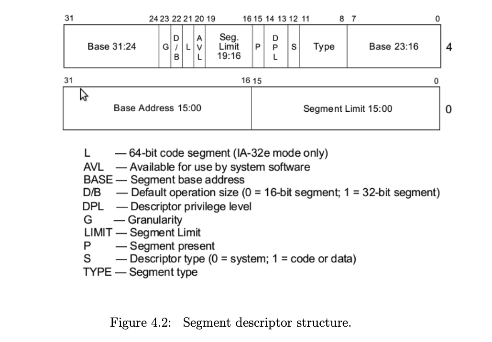

Good video explaining some of the concepts behind GDT
- [Making an OS (x86) Chapter 6 - Entering Protected mode, GDT](https://youtu.be/Wh5nPn2U_1w)

### Segment Descriptor Parts 

A segment descriptor is an 8-byte structure that defines the following properties of a protected-mode segment:

- Base address (32 bits), which defines where the segment begins in physical memory
- Segment Limit (20 bits), which defines the size of the segment
- Various flags, which affect how the CPU interprets the segment, such as the privilige level of code that runs within it or whether it is read- or write-only.

This is the base & limit discussed in your OS class @Swarom. 

### Diagram

This is how we wrote the code, look properly!

This image depicts the structure of a segment descriptor in the context of Intel x86 architecture. A segment descriptor is a data structure in a GDT (Global Descriptor Table) or LDT (Local Descriptor Table) that provides the processor with the size and location of a segment, as well as access control and status information.

Here's a breakdown of the segment descriptor fields as shown in the image:

1. **Base Address (31-24 and 23-16 and 15-0)**: This is a 32-bit value spread across three fields in the descriptor. It specifies the starting physical address of the segment in memory. The fields are split across the descriptor to interleave with other flags and segment limit bits.

2. **Segment Limit (19-16 and 15-0)**: This is a 20-bit value that specifies the size of the segment. The maximum size of a segment is \(2^{20}\) bytes (or 1 MB) when granularity is set to 0, which means the segment limit is interpreted in byte blocks. If the granularity is set to 1, the limit is interpreted in 4 KB blocks, allowing for a maximum segment size of \(2^{20} * 4 KB = 4 GB\).

3. **D/B (Default operation size)**: This bit determines the default operation size (0 for 16-bit segment, 1 for 32-bit segment). This would typically affect the size of the offset in logical addresses and the default size of operands in segment.

4. **G (Granularity)**: When set, this bit scales the segment limit by 4 KB, which changes the addressing from byte granularity to page granularity. This allows for a larger addressable range within a segment.

5. **DPL (Descriptor Privilege Level)**: These two bits determine the privilege level of the segment. The CPU uses these bits to ensure that software operations have the appropriate privilege to access the segment.

6. **P (Segment present)**: This bit indicates whether the segment is present in memory. If this bit is set to 0, the segment is not present, and any attempt to access it will cause a segment not present exception.

7. **S (Descriptor type)**: This bit determines whether the segment descriptor is for a system segment (0) or a code/data segment (1).

8. **Type**: These 4 bits further define the type of segment (code segment, data segment, etc.) and the access rights, such as read/write permissions.

9. **AVL (Available for use by system software)**: This bit is available for use by system software. It is not used by the CPU and does not affect segment operation.

10. **L (64-bit code segment)**: This bit is only used for 64-bit code segments (in IA-32e mode only) and determines whether a code segment executes in 64-bit mode.

The diagram shows a 64-bit code segment which is applicable to IA-32e mode only. The various flags and fields are used by the processor to manage access to the memory segment and enforce protection and control over how the segment can be used. If any of the fields are not configured correctly, it could lead to faults or improper behavior of the software running on the processor.

## Code Segment Config 

- Base: `0x0`
- Limit: `0xffff`
- Present: 1, since we have segment in memory
- Descriptor type: 1 (for code)
- Type Flags
  - Code: 1
  - Conforming: 0
    - By not corming it means code in a segment with a lower privilege may not call code in this segment - this a key to memory protection.
  - Readable: 1
  - Accessed: 0
- Other Flags
  - Granularity: 1
    - if set, this multiplies our limit by 4 K (i.e. 16\*16\*16), so our 0xfffff would become 0xfffff000 (i.e. shift 3 hex digits to the left), allowing our segment to span 4 Gb of memory
  - 32-bit default: 1
  - 64-bit code segment: 0, unused on 32-bit processor
  - AVL: 0

### Data Segment Config 

Since we are using a simple flat model, with two overlapping code and data segments, the data segment will be identical but for the type flags:

- Code: 0 for data
- Expand down: 0
- Writable: 1. 
  - This allows the data segment to be written to, otherwise it would be read only
- Accessed: 0
  - This is often used for debugging and virtual memory techniques, since the CPU sets the bit when it accesses the segment

### Loading GDT

We have already seen examples of how to define data within our assembly code, using the db, dw, and dd assembly directives, and these are exactly what we must use to put in place the appropriate bytes in the segment descriptor entries of our GDT. 

Actually, for the simple reason that the CPU needs to know how long our GDT is, we don’t actually directly give the CPU the start address of our GDT but instead give it the address of a much simpler structure called the GDT descriptor (i.e. something that describes the GDT). The GDT is a 6-byte structure containing:

### GDT Descriptor

The GDT Descriptor: This is a separate structure, sometimes called the GDTR (Global Descriptor Table Register). It is a 6-byte (48 bits) structure that the CPU uses to locate and define the size of the GDT itself, not the individual segments within it.

Here's what the 6-byte GDT descriptor structure contains:

- Limit: A 16-bit value defining the length of the GDT minus one (because the limit is zero-based).
- Base Address: A 32-bit value defining the linear address where the GDT starts.

When the processor is switched to protected mode, the GDTR register is loaded with the address and limit of the GDT through the `LGDT` instruction.

### Code clarification with GPT4

Let's address your questions one by one:

### Defining the Code Segment Descriptor

1. **Why is the base written multiple times, once as 16-bit and then as 8-bit?**
   
   The base address of the segment is a 32-bit value, but there isn't a single directive that directly allows us to write 32 bits contiguously in x86 assembly. The `dd` (define doubleword) directive only allows for 4-byte (32-bit) constants. However, a segment descriptor's base address is split across non-contiguous bits in the descriptor format. Therefore, we have to split the 32-bit base address into parts and use different directives to place those parts in the correct position within the descriptor.
   
   Here's how it's split:
   - `dw 0x0`: Defines the lower 16 bits of the base address.
   - `db 0x0`: Defines the next 8 bits (bits 16-23) of the base address.
   - `db 0x0`: Finally, defines the highest 8 bits (bits 24-31) of the base address.

2. **Why are we randomly adding the limit '1111' in the 2nd flags?**
   
   The '1111' isn't added randomly; it's the upper 4 bits of the segment limit. The segment limit is a 20-bit value, but as with the base address, we can't define all 20 bits at once. So, we use:
   - `dw 0xffff`: This defines the lower 16 bits of the limit.
   - `db 11001111b`: The last nibble '1111' here represents the upper 4 bits of the limit (when the granularity flag is set, each unit in the limit is 4096 bytes, not 1 byte, effectively giving us a limit of 4 GB).

3. **Why do we have `db 0x0` at the end?**
   
   This `db 0x0` represents the highest 8 bits (24-31) of the base address. It's set to zero because, in this particular case, the segment is defined to start at the linear address 0x0.

### Calculating the Size of the GDT

The expression `gdt_end - gdt_start - 1` calculates the size of the GDT for the GDT descriptor. This works because:

- `gdt_end`: Is a label that represents the address immediately after the last byte of the GDT.
- `gdt_start`: Is a label that represents the address of the first byte of the GDT.
- Subtracting these two gives us the size of the GDT in bytes.
- We subtract 1 because the limit field in the GDT descriptor is the size of the GDT minus one. This is because the GDT starts counting from zero. So if the GDT has one entry (8 bytes), the limit would be `8 - 1 = 7`.

In assembly language, labels represent addresses, and arithmetic operations on labels are resolved by the assembler during compilation. So this expression is used by the assembler to calculate the size of the GDT at compile time, which is then hard-coded into the GDT descriptor as a literal value.

